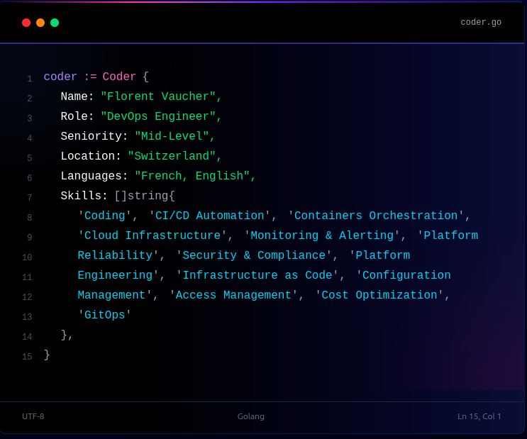

<h1 align="center">Hi there 👋, I'm Florent Vaucher</h1>

  💻 <strong>DevOps Leader</strong> &nbsp;|&nbsp;
  🤖 <strong>Automation Enthusiast</strong> &nbsp;|&nbsp;
  🌟 <strong>Solutions Architect</strong> &nbsp;|&nbsp;
  📚 <strong>Lifelong Learner</strong>

  
  
  
  

  

<h3 align="center">Tools I like to use</h3>
<table align="center">
   <tr>
    <td><strong>Development</strong></td>
    <td>
      
      
      
    </td>
  </tr>
  <tr>
    <td><strong>Containers & Orchestration</strong></td>
    <td>
      
      
    </td>
  </tr>
  <tr>
    <td><strong>Infrastructure as Code</strong></td>
    <td>
      
      
      
    </td>
  </tr>
  <tr>
    <td><strong>CI/CD & Automation</strong></td>
    <td>          
      
      
      
    </td>
  </tr>
  <tr>
    <td><strong>Monitoring & Observability</strong></td>
    <td>
      
      
      
    </td>
  </tr>
 <tr>
  <td><strong>Cloud Platforms</strong></td>
  <td>
    
    
  </td>
</tr>
</table>
